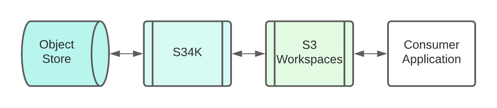

= S3 Workspaces
:vpdb-gh: https://github.com/VEuPathDB

:feature-version: 5.0.0
:actual-version: 5.0.0

:source-highlighter: highlightjs

image:https://img.shields.io/badge/jvm-16-blue[title="Compatible with JVM 16"]
image:https://img.shields.io/github/v/tag/veupathdb/lib-s3-workspace[GitHub tag (latest SemVer)]

A thin wrapper library around {vpdb-gh}/lib-s34k[S34K] treating an S3 object
store as a remote filesystem.

This library comes in 2 flavors:

. `workspaces-kt`: A Kotlin-oriented coroutine based API using suspend methods
for blocking operations.
. `workspaces-java`: A Java compatible mirror of the Kotlin API utilizing
thread blocking.

== Workspaces

Workspaces are directories keyed on a {vpdb-gh}/lib-hash-id[HashID] which
contain files and sub-workspaces relevant to a specific job.

NOTE: As S3 stores have no concept of directories, workspaces are marked with a
special file named `.workspace`.  This file is kept at the root of a workspace.
This library uses the workspace marker file to simulate directory and file
operations.

== Development

=== Design

This library stands between a "workspace" based application (such as
https://github.com/VEuPathDB/service-multi-blast[MultiBlast]) and an https://github.com/VEuPathDB/lib-s34k[S34K] wrapped
S3 Object store instance.

This library wraps S34K and provides filesystem like operations and utilities that are backed by requests to the S3
server.

.**Example**
[source, kotlin]
----
val factory = WorkspaceFactory(s3, "bucket-name")

val workspace = factory.create(HashID.ofMD5("my workspace id"))

workspace.copy(File("my-file"), "my-remote-path")
----

=== Implementation

The workspaces API is implemented in 2 parts for the separate Kotlin and Java
API versions.  The core functionality is implemented in
link:lib/kotlin[`workspaces-kt`] using coroutine compatible code whereas
link:lib/java[`workspaces-java`] defines a mirror of the API defined in
`workspaces-kt` minus the parts incompatible with Java, delegating all methods
to the functionality implemented in `workspaces-kt` but wrapping the coroutine
execution in `runBlocking` calls to pin them to the calling thread.

This means that when changing the public API of this library, both versions need
to be updated at once.

The end result may be illustrated with the following:

[source, kotlin]
----
/** workspaces-kt **/                    | /** workspaces-java **/
                                         |
interface KotlinAPI {                    | interface JavaAPI {
  suspend fun doSomething()              |   fun doSomething()
}                                        | }
                                         |
class KotlinImpl {                       | class JavaImpl {
  override suspend fun doSomething() {   |   override fun doSomething() {
    ...                                  |     runBlocking {
    ...                                  |       kotlinDelegate.doSomething()
    ...                                  |     }
  }                                      |   }
}                                        | }
----

=== End-to-End Testing

This repo contains an end-to-end test suite consisting of a standalone application with a docker-compose stack that runs
that application against a blank MinIO instance.

This application consumes the `lib-s3-workspace` library as a standard gradle dependency and operates as an 'unrelated'
service.

==== Execution

The end-to-end tests may be executed by doing the following:

[source, shell]
----
$ cd test
$ make end-to-end
----

This will build the docker-compose stack then spin it up to run the test application.

===== Reporting

The test application outputs a series of log lines, each with the name/description of the test.  If the test succeeds,
nothing further will be logged from that test, and the next test will be executed.  If the test fails, an error line
will be printed immediately following the failed test's name.

Additionally, a summary will be printed at the end of the tests with the number of passed/failed tests.

.Output
[source%nowrap]
----
2022-05-10T14:29:46,212 [INFO ] [   Root WorkspaceFactory] WorkspaceFactory.get when workspace does not exist.
2022-05-10T14:29:46,295 [INFO ] [   Root WorkspaceFactory] WorkspaceFactory.get when workspace does exist.
2022-05-10T14:29:46,361 [INFO ] [   Root WorkspaceFactory] WorkspaceFactory.create when workspace does not exist.
2022-05-10T14:29:46,399 [INFO ] [   Root WorkspaceFactory] WorkspaceFactory.create when workspace already exists.
2022-05-10T14:29:46,455 [INFO ] [   Root WorkspaceFactory] WorkspaceFactory.get when workspace does not exist.
2022-05-10T14:29:46,462 [INFO ] [   Root WorkspaceFactory] WorkspaceFactory.get when workspace does exist.
2022-05-10T14:29:46,517 [INFO ] [   Root WorkspaceFactory] WorkspaceFactory.create when workspace does not exist.
2022-05-10T14:29:46,565 [INFO ] [   Root WorkspaceFactory] WorkspaceFactory.create when workspace already exists.
2022-05-10T14:29:46,898 [INFO ] [                  Tester] Succeeded: 8
2022-05-10T14:29:46,898 [INFO ] [                  Tester]    Failed: 0
----

==== Development

The end-to-end tests live as a separate/standalone project under the `./test` directory in this repository.  It is
"separate" in that it has no ties and is not a submodule of the Gradle project in the repository root.

Under the test directory the tests themselves are defined under `./src/main/kotlin`.

The entrypoint for the tests is the file `App.kt` which calls the specific test classes and tallies the results.

Each test class is loosely modeled after an implementation class with calls to each of the functions with a number of
different inputs/scenarios.